来自课本的知识点整理，计算机网络网络层。

#  第四章：网络层

##  4.1网络层提供的两种服务

网络层应该提供怎样的服务？是面向连接的还是无连接的，这引起了长期的争论，但是争论焦点的实质是：在计算机网络的通信中，可靠的交付应该由谁来负责，是网络还是端系统。有人认为该借鉴电信网的成功方式，通过面向连接的方式，在连接之前先建立一条虚电路，在通讯中运用这个电路通信，虽然安全、信息不会丢失，但是显而易见的是，这样的连接很复杂，且速度可能相对偏慢。

于是互联网的先驱们采取了崭新的互联网设计思路，核心思想是计算机比电话聪明，足以有应对差错的能力，因此，有了网络层向上只提供简单灵活的、无连接的、尽最大努力交付的数据报服务。**每一个分组独立发送，前后分组无关，不编号，可能出错丢失重复，也不保证交付的时限**，这样网络的造价大大降低，运行方式灵活，能够适应多种应用。

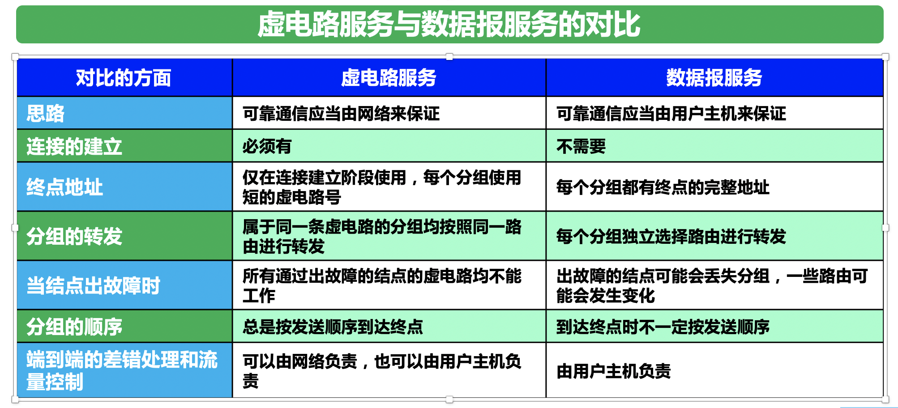

##  4.2网际协议IP

与IP协议配套使用的还有三个协议：1、地址解析协议ARP 2、国际控制报文协议ICMP 3、国际组管理协议IGMP

###  虚拟互联网络

利用IP协议可以使性能特异的网络在网络层上看起来像统一的网络。（可以理解为隐藏差异）

###  分类的IP地址

分类的IP地址将网络分为若干个固定类，A、B、C类都由固定长度的字符串组成。**第一个字段表示网络号，表示连接到的网络，他在整个互联网范围内是唯一的。第二个字段是用户号，标志着主机（路由器），主机号在网络号指明的范围中也是唯一的。**因此IP地址是惟一的。

A、B、C类地址的网络号字段最前面有1、2、3的类别位，分别是0、10、110。同时他们的主机号字段分贝是1个字节，两个字节，三个字节长。

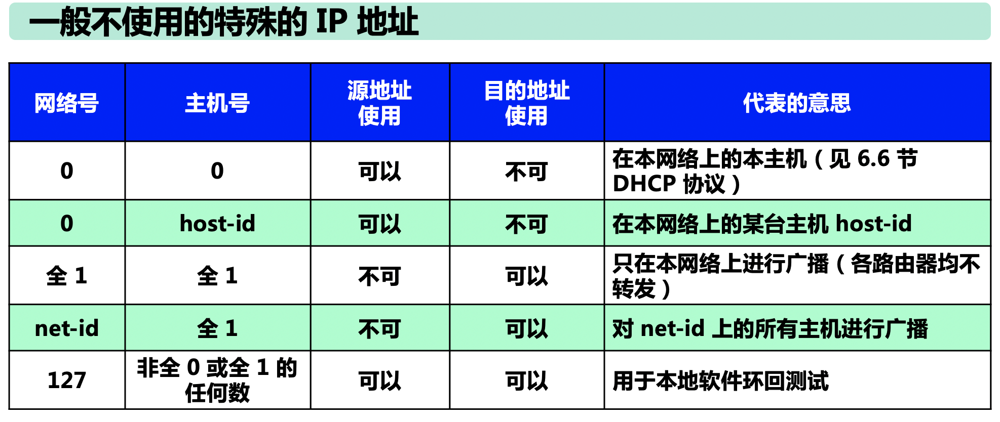

IP地址也具有以下特点：

1.  地址由两部分组成，可以说是分等级的。地址管理器在分配IP地址时只分配网络号，剩下的主机号由网络号单位进行分配。路由器仅根据网络号来转发分组，这样路由表中的项目减少，减少了路由表的存储空间以及查找路由表的时间。
2. 实际上IP地址是标志一个主机和一条链路的接口，当一台主机连接两个网络时就应该有两个IP地址。
3. 一个网络是指具有相同网络号主机的集合，不同网络号的局域网要用路由器进行互连。

###  IP地址和硬件地址

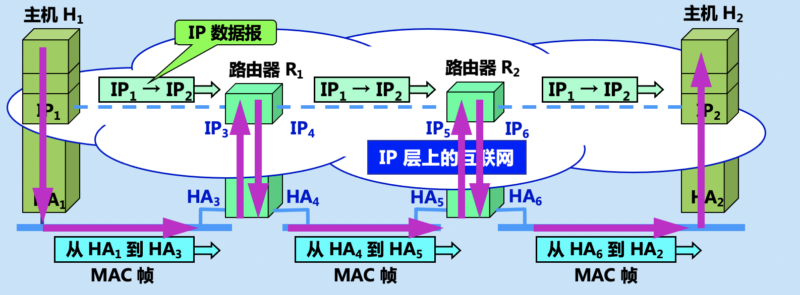

1.  在IP层抽象的互联网上只能看到IP数据报，源地址和目的地址始终是IP1和IP2。
2. **路由器只根据目的站的IP地址的网络号进行路由选择。**
3. 在局域网中链路层，只能看见MAC帧
4.  **IP层抽象的互联网屏蔽了底层的细节，只要在网络层上讨论问题，就能够使用统一的、抽象的IP地址研究主机和主机或路由器之间的通信。**

###  地址解析协议ARP

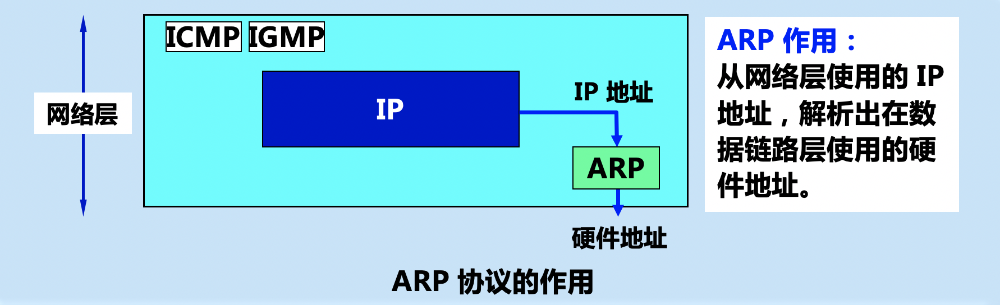

地址解析协议ARP会在主机中设有ARP高速缓存，这个缓存中存放各主机路由IP地址到硬件地址的映射表，并且这个映射表还定期更新，解决表中数据变动的问题（可能有新增的主机或是有主机撤走）。

主机A向主机B发送数据时，一般而言会有以下两种情况，简单的来讲：

1. 主机B的IP地址在主机A的ARP缓存中存在，显而易见，这种情况直接把IP地址写入MAC帧，然后传输即可。
2. 主机B的IP地址在主机A中不存在，这种情况主机A会向局域网上的主机广播发出ARP请求分组，类似于“我的IP地址是XXX，MAC地址是XXX，IP地址为ZZZ的，你的MAC地址是多少”，不是ZZZMAC地址的主机不会理会这个请求分组，而主机B的IP地址和主机A中要查询的地址一致，于是就将自己的MAC地址写入ARP请求分组，并且**单播**给A。主机B同时也会在他自己的ARP高速缓存中存储A的IP地址MAC地址映射。

ARP高速缓存中的映射还有生存时间，凡是超过生存时间的就会删除。这就是为了防止出现通讯时，一台机子的MAC地址突然改变，但是IP地址MAC地址的映射仍然不改变，两个机子之间无法进行通信的问题。

**ARP是解决同一个局域网上主机或路由器的IP地址和MAC地址的映射问题的。如果另一台主机不再该局域网上，就可以用路由器做中转。**

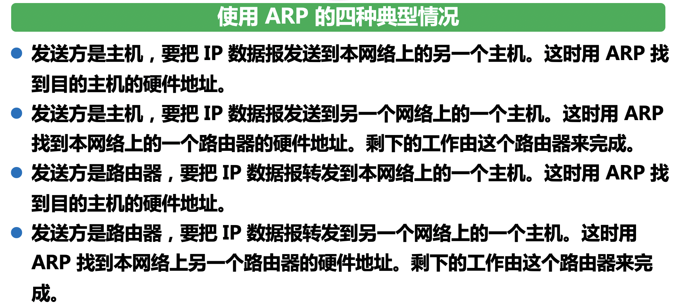

###  IP数据报的格式

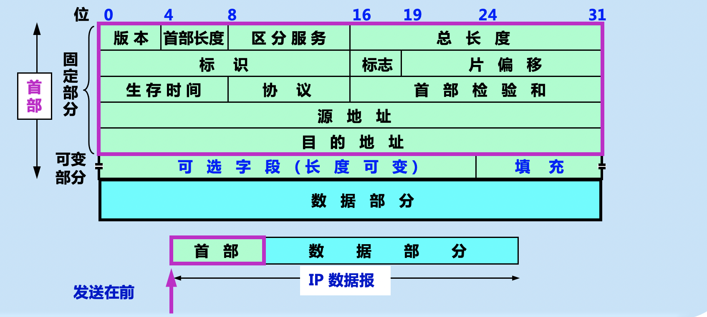

IP数据报由首部和数据部分组成，首部固定部分的长度为20字节，有长度可变的可选字段。

1.  版本：即使用的IP协议版本。
2. 首部长度：总共4位，最多可以表示十进制数15。一个单位代表4个字节，由于首部的固定长度是20字节，因此首部长度这个区域的值最小是5，如果有多出来的长度不是4的倍数，填充部分会自动补0，来保证首部的长度是4字节的倍数。
3. 区分服务：这个属性没啥用。
4. 总长度，记录IP数据报的总长度。有16位，那么数据报的最大长度是65535字节，实际上这种情况是不可能的。各个IP层下面的数据链路层都规定了MTU，大于MTU的数据就要分片传输，分片传输时每个片都要复制一份数据报首部放在片头。
5. 标识：**不是编号**，只用来标志记录，在分片传输情况下，就是用标识判断哪些数据报片属于原先的数据报。
6. 标志：占三位，目前只有两位有意义。最低位MF：表示后续还有分片。中间位DF表示是否能进行分片，值为0时表示可以分片。
7. 片偏移：指出数据片在原分组中的相对位置，片偏移是以8个字节为偏移单位的，这就表示了除了最后一个数据片意外，其他被分数据片的长度都是8的倍数。
8. 生存时间：防止数据报在网络中无限制的兜圈，生存时间一到就销毁。生存时间代表着“跳数限制”，即表示最多能经过几个路由器，没经过一个路由器，生存时间就-1。
9. 协议：这个协议指出数据报携带的数据属于哪种协议，以便使目的主机的IP层知道将IP数据报交付那个上层协议处理。
10. 首部检验和：这个字段是用来检验数据报首部的，不检验数据部分，**不使用CRC校验。**
11. 源地址：12位，懂得都懂。
12. 目的地址：12位，懂得都懂。
13. 可变部分：有各种用途，功能很丰富，不详细解释。但也是因为有了可变的部分，增加了路由器处理数据报的开销。

###  ip层转发分组的流程

虽然互联网所有的分组转发都是基于目的主机所在的网络，但大多数情况下都允许有这样的特例，即对特定的目的主机指明一个路由，这种路由叫做**特定主机路由**。

还有一种默认路由，简单的理解就是查找路由表中的其他项，没有找到合适的，就是用这个默认路由，将数据报交付给这个默认路由指示的下一跳，这个适用于一个网络有很少的对外连接情况。

当一个路由器收到待转发的数据报，从路由表得出下一跳的IP地址之后，不是将这个数据填入IP数据报（==IP数据报中早就有源ip地址，目的ip地址了==），而是交送数据链路层的网络接口软件，接口软件将IP地址通过ARP转换成MAC地址，将MAC地址放在MAC帧首部，然后根据硬件地址转发到下一跳路由器。

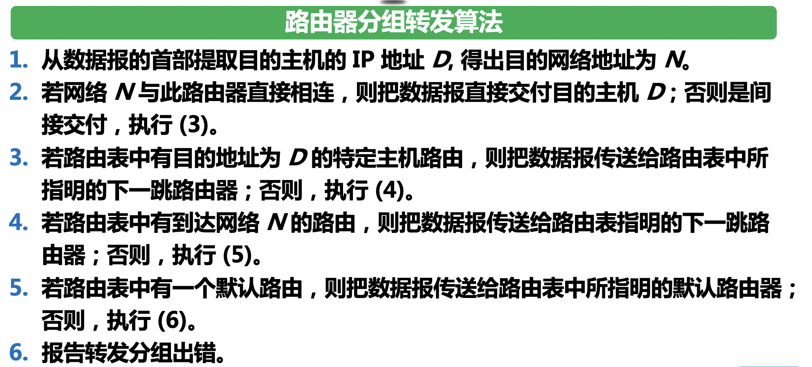

IP转发的过程并不是直接知道转发的道路，而是走一步问一步。

##  4.3划分子网和构造超网

###  划分子网

+ ####  从二级地址到三级地址

  从二级地址到三级地址，为什么要划分子网。

  1.  IP地址的利用率低，一个公司可能去申请B类地址，导致地址大量的浪费。
  2. 给每一个物理网络分配网络号会使路由表变得太大，效率变低。
  3. 二级IP地址不够灵活，紧急开通网络速度较慢。

  **于是从1985年起，IP地址中又增加了子网号字段，IP地址由两级变成了三级，使用比较灵活，这就叫做划分子网，目前划分子网已经成为互联网的正式标准。**

  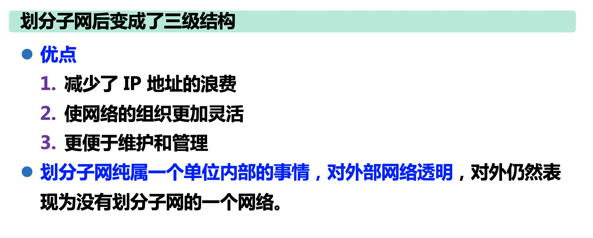

  子网号是从主机号中分出来的。

+ ####  子网掩码

  从IP数据报首部无法看出源主机或者目的主机的网络进行了子网的划分，因此判断网络地址还需要一样东西，那就是子网掩码。

  长话短说，子网掩码典型的特征就是前面的位都是1，后面的位都是0，它主要用于判断转发的网络地址，将目的IP地址和子网掩码进行按位与操作，根据子网掩码的特点，主机号与0相与全部变成0，剩下的就是网络号与1相与，等于网络地址本身，将得到的网络地址和路由器路由表上的网络地址进行比对，路由器就知道是否要转发了。

  使用子网时的跳转和之前的很类似：

  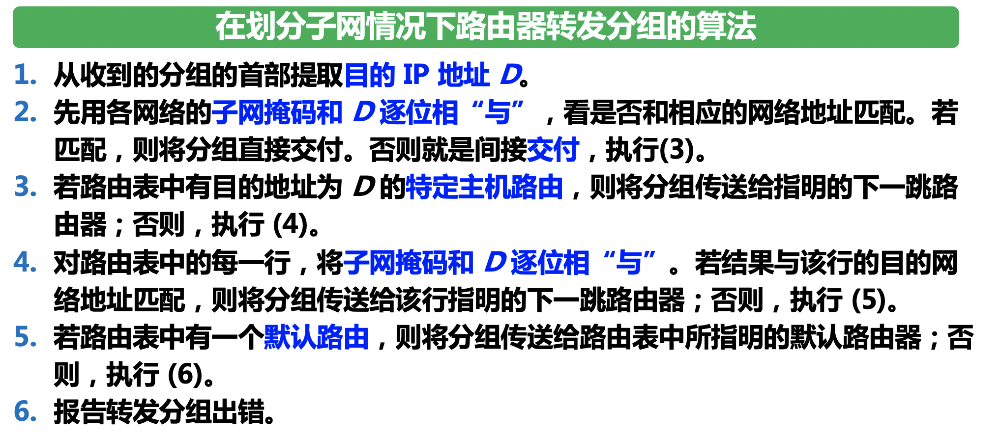

###  构造超网（无分类编制CIDR）

+ ####  网络前缀

  CIDR的主要特点：

  1. 消除了传统的ABC类地址划分的概念，消除了划分子网的概念。
  2. IP地址由网络前缀和主机号组成，并发明了斜线计法（斜线代表掩码前面几个1）。

  一个CIDR地址块中有很多地址，路由表中就利用CIDR地址块来查找目的网络，这种地址的聚合被称作路由聚合。

+ ####  最长前缀匹配

  路由表中进行查找路由表的时候，可能会得到不止一个的匹配结果，这时候就要选择最长的去匹配。

  匹配涉及到匹配的算法，最简单的算法就是对于每一个可能的网络前缀长度，直接从地址中提取M位，然后到路由器中找跟M位相关的匹配，这种算法虽然简单，但是一旦路由器中没有地址，算法就要进行32次，效率较低。

  为了提高效率，就会采取二叉线索查找。找出每个IP地址对应的唯一前缀构造二叉树，这样查找起来每个地址都对应唯一的叶子节点。现在考虑两种情况，第一种是路由表中没有对应的目的IP地址，这样在查找的时候，就会找不到对应的唯一前缀，直接就可以停止查找，第二种情况是能找到叶子节点，这个时候还要将目的地址和叶子节点的掩码进行与操作，看看是否能匹配上。

##  4.4 国际控制报文协议ICMP

为了更有效的转发IP数据报和提高交付成功的机会，在网际层使用了国际控制报文协议ICMP。ICMP允许主机或路由器报告差错情况和提供有关异常的报告。ICMP是互联网的标准协议。但是ICMP不是高层协议，他是IP层的协议，他封装在==IP数据报的数据部分==。

###  ICMP报文的种类

ICMP报文的种类有两种，即ICMP差错报文和ICMP询问报文。

ICMP报文的前4个字节是统一格式，共有三个字段：类型、代码和检验和。紧接着的4个字节和ICMP的内容有关。而根据内容的不同，数据字段的传送也不同。

下面是ICMP差错报文的格式：

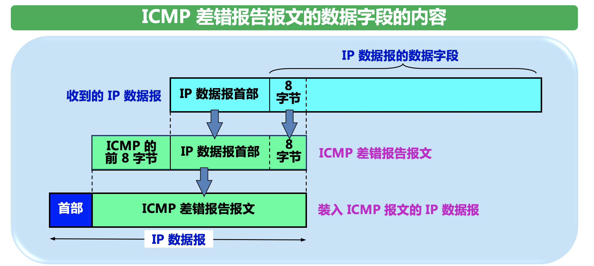

下面是不应该发送报文的几种情况：

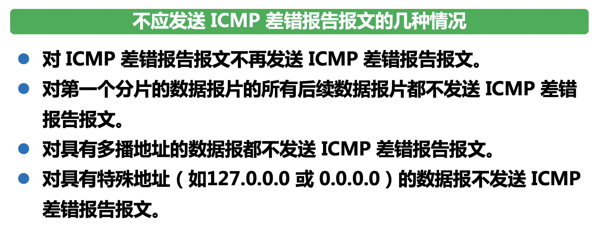

###  ICMP的应用举例

**ping命令和tracert命令是ICMP应用的例子，是应用层直接使用网络层ICMP的例子。**

ping命令的原理：向目的主机发送4个ICMP回送请求报文，等待目的主机的回送。

tracert命令的原理：不断向目的主机发送IP数据报，数据包中封装的是无法交互的UDP用户数据报。不断地把TTL的数值设为1、2、3、4......这样在途中TTL过期之后路由器会发回时间超过的报文，达到目的主机时会发送回终点不可达的报文，因此实现了功能。

##  4.5 互联网的路由选择协议

+  ###  内部网关协议RIP

  是一种分布式的基于向量的路由选择协议，和直连网络的距离是1，其他依次加1，最大距离只能有包含15个路由器，距离等于16时等于不可达，因此RIP只属于小型网络。不能在两个网络之间选择多个路由，即使有一条路由的速度更快，永远选择路由器少的路。

  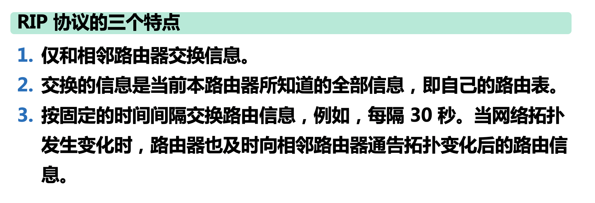

  好消息传的快，坏消息传的慢。最大优点是实现简单，开销比较小。

+ ###  内部网关协议OSPF

  使用分布式的链路状态协议。

  

  更新过程收敛的快是其优点。

  ##  4.8虚拟专用网VPN和网络地址转换NAT

  + ###  虚拟专用网VPN

    生活生产实际中产生需要的本地地址需要：

    1.  一个公司能够申请到的IP地址远远小于机构能给他分配的IP地址，公司中的很多主机只需要内部通信，不需要连接到外部的互联网，因为他不访问外部，并且外部的互联网也不是这么安全。
    2. 公司大量的内部主机如果随意分配IP地址，若有个时候突然想要访问外部，他的IP地址可能会和外部的IP地址重复。

    为了解决这些问题，同时为了满足大量的本地地址需要，于是RCF1918 指明了一些专用网络的地址，他们指定了一些IP地址作为内部的专用地址，不能用作访问外部，路由器在遇到专用地址时，不对他们进行转发。

    采用这样专用IP的网络可以成为专用互联网，在多个不同地方的专用互联网中，很可能有很多IP地址是重复的，因为他们可能都使用上文讲到的供内部专用的IP地址。

    **现在产生了一个新的需求，一个公司可能有多个机构分布在各地，员工也可能分布在各地，那还要怎么满足内部通信的安全需要？**

    第一种情况是找专用机构搭专线，显然成本过高；第二种方法是使用互联网，不同的内部机构在互联网上交流，俨然像公司的内网，但是借助的确实互联网，形象的叫做虚拟专用网。

    VPN用到了隧道技术，简单的原理就是，将用于内部交流的数据报加密，==路由器收到内部加密的数据报之后会将加密的数据报封装成互联网上的数据报发送出去==，这样就实现了机构之间的通信。

    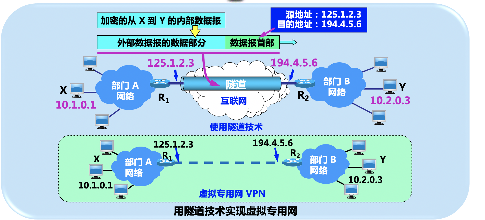

  + ###  网络地址转换NAT

    这个技术用于内部拥有本地地址的主机访问外部时使用，他只是将地址换了一下。因此他需要用到专用的NAT路由器，这个路由器一定要有一个可以访问外部的IP，内部的机子想访问外部的时候，NAT路由器直接就把内部地址转换成可以访问外部的IP地址。

    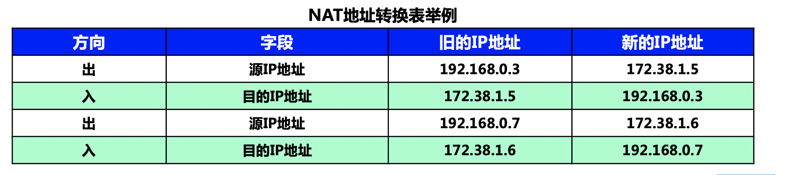

    NAT路由器中会有一个map表记录两个IP之间的映射，只有在内部主机访问外部，到达路由器时才会做记录，因此外部是访问不到内部的。

    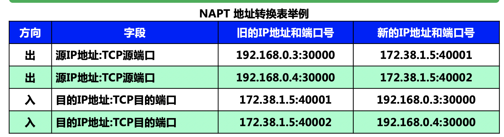

    NAPT在进行地址变换的时候不同的主机使用不同的端口，原先的NAT一台主机只能对应一个外部的IP，但是运用NAPT多台主机可以对应一个外部的IP，前提是这个外部IP的端口不被用完。（用到了端口，与运输层有一定关系）

