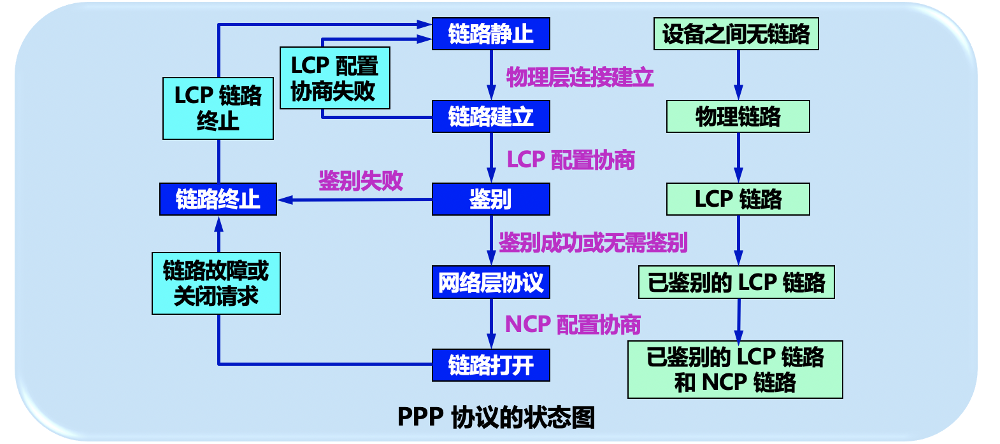
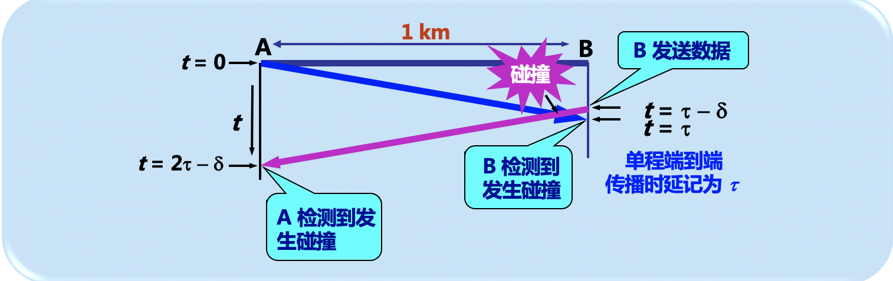

来自课本的知识点整理，计算机网络数据链路层。
#  第三章：数据链路层

##  前言

数据链路层使用的信道主要有以下两种类型：

1.  点对点的信道。这种信道使用一对一点对点的方式。
2. 广播信道。这种信道使用一对多的广播通信方式，因此过程是比较复杂的。广播信道上的连接主机很多，因此必须使用专用的共享信道协议来协调这些主机的数据发送，即用协议来解决冲突。

##  3.1 使用点对点信道的数据链路层

+  ###  数据链路和帧

  首先清楚的是概念，“链路”和“数据链路”是两个不同的概念，“链路”指的是一个节点到另一个节点的一段物理路线，而“数据链路”**则是将实现传输协议的硬件和软件加到链路上构成的。**

  点对点信道的数据链路层的协议数据单元称作帧。

  点对点信道的数据链路层在进行通信时的主要步骤：

  1.  将网络层交下来的IP数据报添加首部尾部封装成数据帧。（封装成帧）
  2. 把装好的帧发送到下一个节点。（透明传输）
  3. 收到帧的结点进行查错。（差错检测）

+ ###  三个基本问题

  无论是任何的协议都面临着封装成帧、透明传输、差错检测的问题。

  1.  ####  封装成帧

     将网络层交下来的数据添加首部和尾部，收到该帧的结点就能根据首部和尾部判断帧的开始和结束。每个帧的数据部分不超过MTU个长度，MTU不宜过大也不宜过小，太小会导致效率的浪费，太大则会被拒绝发送，或许可以理解为一旦丢失出错重传的数据将会非常多。

     当数据是ASCII组成的文本文件时，帧定界可以使用特殊的帧定界符。可以在帧的首尾部分别加入SOH、EOT控制字符，这样接收端便能明确的判断帧的各种情况，并且做出相应的处理。

  2.  ####  透明传输

      “透明”即某一个实际存在的事物看起来却像不存在一样。在传输时，如果传输的是ascii文本文件，那么它的数据部分就一定不会出现SOH、EOT这样的帧定界控制字符。但是在传输二进制文件时，难免会有二进制码与帧界定标志二进制码相同的情况出现，这样就会引起接收端的错误判断，一般采取的方法是在**数据中出现“SOH”、“EOT”**的前面加上转义字符，接收端收到以后再将转移字符拿掉。对于数据来说，数据是看不见数据链路层有什么阻碍它传输的东西的，因此数据链路层对于数据来说是透明的。透明传输可以理解为，对于传送的数据没有任何的限制；与之相对，非透明传输对传输数据的要求是有限制的。简而言之，透明传输就是啥都可以传。

  3.  ####  差错检验

      现实的通讯链路不是理想的，难免在传输数据时会有比特出现错误，这叫做比特差错。为了避免出现数据差错，在传输数据时会采用差错检验的机制，目前广泛采用的是**CRC技术（必考）**，见书本P75，在接收端收到的每一帧经过CRC检验之后，如果余数为0，那么就接受帧，如果余数不为0，那么就丢弃帧。

      OSI的观点是必须让数据链路层向上提供可靠传输，显然使用CRC只保证了比特不出错，仍然有传输出错的可能，如帧重复，帧失序等等。因此数据链路层在基础上又增加了**帧编号、确认、重传**的机制，这就保证了可靠性。

      对于通信质量良好的有线传输链路，数据链路层协议不启用确认和重传机制；对于差的传输链路，开启确认和重传机制。实践证明这是可以提高通讯效率的。

##  3.2 点对点协议PPP（Point to Point Protocol）

+  ###  协议的特点

  PPP协议就是用户计算机和ISP进行通信时，数据链路层的协议。

  设计PPP协议的时候考虑了以下的需求：

  1.  简单，把最复杂的部分放在TCP协议中，IP协议相对简单，因此数据链路层没有必要实现比IP更多的功能，因此传输是不可靠的。
  2. 封装成帧。
  3. 透明传输，透明传输意味着要解决数据传输透明性的问题，见前面透明性的讲解。
  4. 多种网络层协议，适用于多种场景，无论连接的是局域网还是路由器。
  5. 多种类型的链路。
  6. 差错检测，丢弃差错的帧，以免浪费后面的网络资源。
  7. 检测连接状态。
  8. 最大传输单元。
  9. 网络层地址协商。
  10. 数据压缩协商。

  **PPP不需要：1、纠错（简单特性）2、序号（简单特性）3、流量控制（简单特性）4、多点线路 5、半双工或单工链路（两点之间会有协商？）**

+ ###  协议的组成

  分为3个组成部分：

  1.  数据部分，不超过MTU个长度。
  2. 用于建立、配置、测试数据链路连接的链路控制协议LCP。
  3. 一套网络控制协议NCP，其中每一个协议支持不同的网络层协议。

+ ###  PPP协议的帧格式

  1.  ####  各个字段的意义

     这里主要注意标志字段使用16进制7E表示开始和结束。连续出现两个7E则表示是一个空帧。

  2. ####  透明传输相关

     字节填充：在异步传输时，为了避免字段出现和标志字段一样的组合，就会采取字节填充这样的方法。他的字节填充方法是将起始标志转换成两个转义字符，有冲突再转换，总之就是这样的一个过程。在接收端再用同样的方法转换回来。

     零比特填充：在使用一连串的比特传输时，PPP会采取零比特填充。凡是喷到5个1就会在后面添加一个0，因为7E（01111110）中中间有6个1，避免在数据中也有6个1，就在5个1出现的时候加0。接收端接收到之后去掉0即可。

     **通过上述两种方法就实现了透明传输**

+  ###  PPP协议的工作状态

  

  PPP协议的状态图如上，我觉得这本需要理解的是两点：

  1. 与ISP建立连接，通过向ISP传输LCP分组来初始化连接。
  2. PPP协议适配不同的网络层协议，建立连接之后，还要进行网络层的配置，要根据NCP协议来配置。PPP协议两端的网络层可以使用不同的协议，但是仍然能使用PPP进行通信。

##  3.3 使用广播信道的数据链路层

 局域网使用的就是广播信道，所以使用局域网来讨论。

+  ###  局域网的数据链路层

  局域网的主要优点：

  1. 具有广播功能，从一个站点很方便的可以访问全网。
  2. 随着系统的拓展和演变，各设备的位置可以灵活调整和改变。
  3. 提高了系统的可用性、可靠性、生存型。

  共享信道要考虑的重要问题就是用户能够合理而方便的共享媒体资源。在技术上有两种方法：

  1.  静态划分信道。用户只要分配到了信道就不会和其他用户产生冲突。
  2. 动态媒体接入控制，又称为“多点接入”。这又分为随机接入（可能产生冲突），受控接入（采用轮询的方式，一个个来）。

  + ####  适配器的作用

    计算机与外界局域网的通信是通过适配器进行的。**适配器和局域网之间的通信是通过电缆和双绞线以串行方式进行的，适配器和计算机之间的通信则是通过I/O总线以并行的方式进行的。在网络上的数据率和计算机总线上的数据率大不相同，因此在适配器中装有对数据缓存的芯片。在主板上安装适配器时，在电脑上要同步安装驱动程序，这样以后驱动程序就会告诉适配器，从哪个位置取数据传输，或是将得到的数据放在哪个位置。适配器在接受和发送帧时，不使用计算机的CPU，这意味着CPU能做别的任务。适配器在收到正确的帧的时候产生中断通知计算机，并交付至网络层。发送IP数据报的时候，将数据报交给适配器组装成帧再发送到局域网。**

+ ###  CSMA/CD协议

  为了通信简便，以太网采取了以下的两种措施：

  1.  采用无连接的工作方式，**对数据帧不进行编号，也不要求对方确认返回，就是尽最大的努力交付，是不可靠的交互。**对于差错帧的重传由上层来决定。当有一台计算机在发送数据的时候，总线的传输资源就被占用，因此同一时间只能有一台计算机来发送数据，这里面就会有冲突的问题，解决冲突问题需要协议CSMA/CD。
  2. 以太网发送的数据都使用曼彻斯特编码的信号。简而言之接收端需要检测位同步信号，检测需要获取到数据上的边沿跳变，如果长时间的传输0或1，边沿无法跳变，无法获取到同步信号，因此需要采用曼彻斯特编码。

  CSMA/CD协议的实质是“载波监听”（不管是在发送前还是在发送中，每个站都必须不停的检测信道）和“碰撞检测”（边发送边监听）。

  

  从图中就可以看出A发现冲突的最长时间是2$\tau$时间。也可以看出使用CSMA/CD协议时，一个站不能同时进行发送和接收，因此使用该协议的以太网不能进行全双工通信，只能进行双向交替通信。对于A站，至多2$\tau$之后就能发现有没有冲突产生，把这段时间称为争用期。经过征用期还没发生碰撞，就表示这段时间不会发生碰撞。

  以太网使用截断二进制指数避退算法来处理重传。发生冲突之后，为了避免冲突的再次发生，不是立即将数据再次传输，而是先等待一个随机数的时间再去传输，这个算法就是产生这个等待随机数的，具体见书本P88.

  存在产生冲突时的情况，如果传送的帧数据过短，即使发生了碰撞，接收端收到了有差错的帧并且丢弃，发送端都无法察觉，因为实在是太短了，这样发送端就不知道需要重传，因此，规定了最短帧长是64字节，凡是长度小于64的字节都是由于冲突而异常终止的无效帧，收到了这种帧就立即丢弃。

  在发生碰撞之后，除了立即停止发送数据之外，还要再发送人为干扰信号，以便让所有用户都知道发生了碰撞。

  以太网还规定了帧最小间隔为96个比特时间，这段时间用于清理接受站的缓存，并给接受下一帧做准备。

  CSMA/CD的协议要点归纳如下：

  1. 准备发送：发送以太网帧之前先检查信道。
  2. 检测信道：检测到信道忙则等待至空闲，如果检测到信道空闲，且在96比特时间内仍然空闲，就发送出帧。
  3. 在发送过程中仍然检测信道，边发送边监听。没有发生碰撞就表示发送成功，产生了碰撞就执行回避算法，等待再次发送。

  以太网发送完一帧后，都会将帧暂时保留，以免发生碰撞，进行重传的时候使用。

